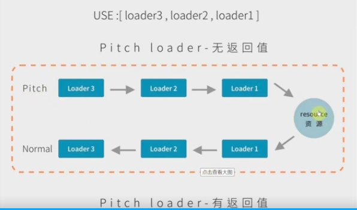

# webpack

代码转化，文件优化，代码分割，模块合并，自动刷新，代码校验，自动发布

打包 支持js模块化(node语法)
解析js模块，解决文件引入的问题，将其打包为一个文件。

## 手动配置webpack

- 默认配置文件的名字 webpack.config.js
- 修改配置文件的名字，通过webpack(默认查找node_modules下的webpack) --config 配置文件的完整路径(webpack.config.js)

## webpack-dev-server

默认的是在根目录下起一个服务，可以直接访问.html文件，并没有真实的打包，只是在内存中打包一份。通过contentBase：指定启动服务的位置。


## 抽离css样式 -- mini-css-extract-plugin

将散落在各地的样式抽离出来，并使用MiniCssExtractPlugin.loader放到link标签中

自动添加前缀 autoprefixer postcss-loader

压缩css文件optimize-css-assets-webpack-plugin


## babel转换代码es5--es6

@babel/preset-env 将es6-es5
@babel/core transform转化源代码

转更高级的语法es7语法
@babel/plugin-transform-runtime 开发时依赖，不需要在每个文件中都校验一次，
开发时 @babel/runtime
可以处理es7-es5的高级功能
"@babel/runtime-corejs3": "^7.9.6",
["@babel/plugin-transform-runtime",{ corejs: 3 }],

## 引入第三方模块

1. expose-loader暴露到全局window上，则可以每个模块都使用。
2. new webpack.Provider全局注入，给每个模块都注入
3. 使用cdn,并且使用externals不对该模块进行打包

## 图片的处理

1. 在js中创建图片引入 
   需要进行import引入路径，这样才会进行打包到对应的目录下，才可以找到正确的路径
2. 在css中引入 background:url('./logo.png')
   css-loader会直接转换为require('./logo.png')
3. html中直接写死 
   html-withimg-loader解决在html中引入的image标签，不会被打包的问题 
   要注意在url-loader中，启用commonjs,不要使用esmodule

## 打包模块的分类

以及在.html文件中添加引入的静态资源的域名
publicPath解决cdn的引入的问题


## sourceMap

cleanWebpackPlugin
copyWebpackPlugin
bannerPlugin(内置模块) 版权申明插件


## webpack跨域问题

## 优化

1. noParse 不去解析第三方库中的依赖关系的图谱
2. IgnorePlugin阻止为正则表达式或过滤器函数匹配的模块本地生成import或require调用。
如moment时间插件中引入的语言包
3. 动态链接库 DllPlugin
4. 多线程打包happypack 在分配多线程的过程中，也会消耗资源
5. import语法在生成环境下会自动去除没用的代码 tree-shaking
6. require语法不会去除没用的代码
7. scope hosting 作用域提升
8. 抽离公共代码


## webpack懒加载

```js
import返回的是一个promise对象,模块中的默认导出是放在了default字段中
    import (/*webpackChunkName:"source"*/'./source.js').then(data=>{
        console.log(data.default)
})
```

## 热更新

只适用于开发环境
devtool中配置hot，则只热更新js
配置热更新插件，则可以更新css
但这些更新都是强制页面全部刷新
只有当写入了accept才会真正的热更新，及页面不刷新，也可以更新内容
module.hot.accept(dependencies,callback)，则不会刷新整个页面，只是更新对应的改变了的dependencies


## tapable 事件流


+ syncBailhook
 熔断，当钩子函数执行时可以决定是否继续向下执行
 当返回的值为undefined时，可以继续向下执行
 当返回值不为undefined时，不可以向下执行

+ syncWaterfallhook
  上一个钩子返回的结果，作为下一次钩子执行的参数

+ syncLoophook
  遇到某个不返回undefined的监听函数会多次执行,需要控制执行的次数

+ AsyncParralleHook 异步并发
 同时发送多个请求
 异步钩子 串行--- 并行--需要等待所有并发的异步事件执行后再执行回调函数
 注册方法，tap同步
 tapAsync(name,callback(data,cb))控制cb的个数  
 tapPromise(name,cb) 注册的是promise Promise.all()方法

 call
 callAsync 
 promise

+ AsyncSeries 异步串行 
  当执行cb()回调函数时，再去执行下一个函数

## loader

loader分类 pre前面--normal--行内---post后面 执行顺序
require('inline-loader!./a.js') !将后面的文件导入到行内loader内解析
require('-!inline-loader!./a.js') 
-!  不会让文件再去通过pre + normal loader来处理
!   没有normal 
!!  什么都不要，只需要inline-loader来解析给该文件

loader 具有pitch 与Normal
当pitch函数有返回值时，会停止后续的所有执行，直接转到对应的loader上


  